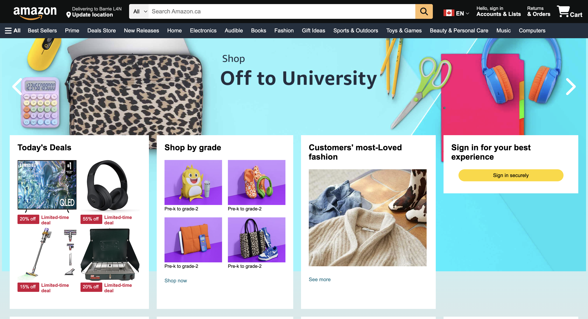
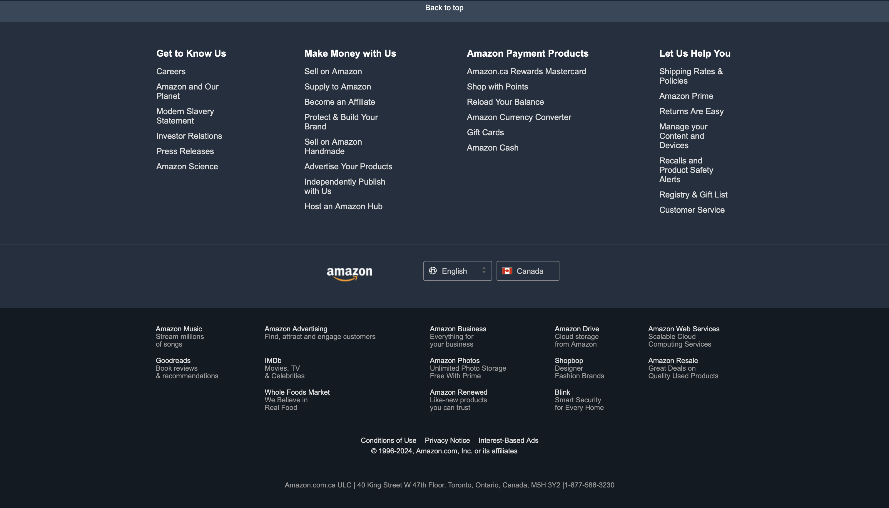

# Amazon Home Page Clone

This is a simple **Amazon Home Page Clone** built using HTML, CSS, and JavaScript. The project replicates the look and feel of the Amazon home page, demonstrating skills in front-end web development and UI design.

## Table of Contents
- [Features](#features)
- [Technologies Used](#technologies-used)
- [Project Setup](#project-setup)
- [Demo](#demo)
- [Screenshots](#screenshots)
- [Future Improvements](#future-improvements)

## Features
- Responsive layout for different screen sizes (desktop, tablet, and mobile)
- Replica of Amazon's navigation bar
- Product display sections with images and hover effects
- Basic interactivity using JavaScript

## Technologies Used
- **HTML5**: Structure and content of the webpage
- **CSS3**: Styling, including Flexbox and Grid for layout
- **JavaScript**: Basic interactivity and dynamic content

## Project Setup
To get started with the project locally, follow these steps:

1. Clone the repository:
    ```bash
    git clone https://github.com/AJ4G4L4N/amazon-home-page-clone.git
    ```

2. Open the project folder:
    ```bash
    cd amazon-home-page-clone
    ```

3. Open the `index.html` file in your web browser to view the clone.

## Demo
You can check out a live demo of the project here: [Amazon Clone Demo](#)

## Screenshots
**Desktop View:**

<p float="left">
  
  
  
</p>

**Mobile View:**


## Future Improvements
- Implement search functionality
- Add a shopping cart feature
- Enhance the product listing section with dynamic content from a mock API
- Improve mobile responsiveness and UI performance

## Thank You
Thank you for checking out this project! If you have any feedback, feel free to reach out or contribute.


